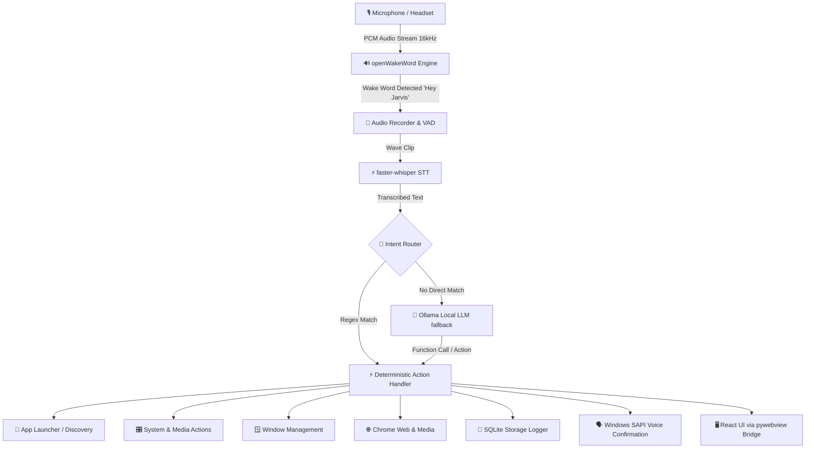

# ⚡ Signal: Local-First Windows Voice Assistant

[](https://www.microsoft.com/windows)
[](https://www.python.org/)
[](https://react.dev/)
[](https://github.com/SYSTRAN/faster-whisper)
[-black?style=for-the-badge&logo=ollama&logoColor=white)](https://ollama.com/)
[](LICENSE)

**Signal** is a private, latency-optimized, local-first voice assistant designed specifically for Windows desktop control. Wake it with **"Hey Jarvis"**, speak naturally, and let Signal launch applications, control media and system audio, snap windows, search the web, and provide instant voice and visual feedback.

> 🔒 **100% Private & Local**: All wake-word processing, speech transcription, intent classification, and desktop automation execute directly on your machine. No external audio streams or cloud dependencies.

---

## 📑 Table of Contents

- [Features & Highlights](#-features--highlights)
- [Architecture Overview](#-architecture-overview)
- [Supported Voice Commands](#-supported-voice-commands)
- [Prerequisites](#-prerequisites)
- [Quick Start & Installation](#-quick-start--installation)
- [Configuration](#-configuration)
- [Running the Assistant](#-running-the-assistant)
- [Development & Testing](#-development--testing)
- [Project Structure](#-project-structure)
- [Under the Hood](#-under-the-hood)
- [License](#-license)

---

## ✨ Features & Highlights

- 🎙️ **On-Device Wake-Word Detection**: Always-listening wake word powered by [`openWakeWord`](https://github.com/dscripka/openWakeWord) (`Hey Jarvis`) with automatic audio stream recovery and reconnection logic for Bluetooth/headset microphones.
- ⚡ **Offline Speech Recognition**: High-speed, CPU-optimized transcription using [`faster-whisper`](https://github.com/SYSTRAN/faster-whisper) (`small.en` int8) with custom domain vocabulary hints.
- 🧠 **Dual-Tier Intent Routing**: Ultra-fast deterministic regex matching for instant execution, backed by a local [`Ollama`](https://ollama.com/) fallback model (`llama3.2:3b`) for flexible natural language commands.
- 🚀 **Smart App Discovery & Cache-Aside Lookup**:
  1. Manual user overrides in `config.py`.
  2. Instant SQLite cache (`app_cache`) for previously learned apps.
  3. Dynamic live Start Menu (`shell:AppsFolder`) and PATH indexing that auto-learns new app paths on the fly.
- 🎛️ **Direct Windows System & Media Control**:
  - Exact volume percentage adjustment via Windows Core Audio API (`pycaw`).
  - Unambiguous media playback controls (`WM_APPCOMMAND` for explicit Play/Pause).
  - Window snapping (Left/Right) targeted by application title or focused window.
  - Workstation lock and application lifecycle termination (`psutil`).
- 🌐 **Web & Music Integration**: Google, Amazon, YouTube, and Spotify searches with chromeless app-mode (`--app=`) media launching in Google Chrome.
- 🎨 **Modern Desktop GUI**: Beautiful glassmorphic HUD built with **React 19**, **Tailwind CSS**, and **Framer Motion**, rendered via lightweight native **`pywebview`** (zero Electron overhead).
- 🔊 **Voice Synthesis**: Low-latency spoken confirmations via native Windows SAPI (`pyttsx3`).

---

## 🏛️ Architecture Overview



---

## 🗣️ Supported Voice Commands

| Category | Example Voice Command | What Happens |
| :--- | :--- | :--- |
| **App Launching** | `Open Notepad`<br>`Open Visual Studio Code`<br>`Open WhatsApp` | Launches app via direct PATH, cached location, or Start Menu discovery. |
| **App Closing** | `Close Notepad`<br>`Close VS Code`<br>`Quit Chrome` | Gracefully terminates matching process instances using `psutil`. |
| **Web Search** | `Search RTX 4070 on Google`<br>`Open Amazon and search mechanical keyboard` | Opens query in Google or Amazon directly in browser. |
| **Music & Video** | `Play Interstellar soundtrack on YouTube`<br>`Play Bohemian Rhapsody on Spotify` | Opens media in standalone chromeless app window. |
| **System Volume** | `Volume to 65 percent`<br>`Volume up` / `Volume down`<br>`Mute` / `Unmute` | Sets exact master volume level via Windows Core Audio or triggers volume keys. |
| **Media Playback** | `Play`<br>`Hold` / `Stop`<br>`Next track` / `Previous song` | Sends explicit Windows media commands without playback state ambiguity. |
| **Window Control** | `Move this window to the left`<br>`Snap Chrome to the right` | Focuses and resizes the target window to 50% split screen. |
| **Security** | `Lock the screen` / `Lock PC` | Immediately locks the Windows workstation. |

---

## 📋 Prerequisites

Before setting up Signal, ensure your system has:

- **Operating System**: Windows 10 or Windows 11 (64-bit)
- **Python**: `3.10` or higher ([Download Python](https://www.python.org/downloads/))
- **Node.js**: `18.x` or higher *(required only if modifying or rebuilding the React UI)*
- **Microphone**: Any built-in mic, USB microphone, or Bluetooth headset
- **Ollama** *(Optional for AI Fallback)*: [Download Ollama for Windows](https://ollama.com/download)

---

## 🚀 Quick Start & Installation

### 1. Clone the Repository

```powershell
git clone https://github.com/<your-username>/signal-assistant.git
cd signal-assistant
```

### 2. Set Up Python Virtual Environment

```powershell
python -m venv .venv
.venv\Scripts\Activate.ps1
pip install -r requirements.txt
```

### 3. (Optional) Set Up Local Ollama Model

If you want intelligent fallback routing for complex, non-standard phrases:

```powershell
ollama pull llama3.2:3b
```

### 4. Build the Frontend UI

Build the production assets for the embedded desktop interface:

```powershell
cd signal-ui
npm install
npm run build
cd ..
```

---

## ⚙️ Configuration

Tune settings in [`config.py`](config.py) to customize Signal for your setup:

```python
# Fixed app shortcuts and UWP shell paths
APPS = {
    "whatsapp": r"shell:AppsFolder\5319275A.WhatsAppDesktop_cv1g1gvanyjgm!App",
    "chrome": r"C:\Program Files\Google\Chrome\Application\chrome.exe",
    "vscode": r"D:\Microsoft VS Code\Code.exe",
    "netflix": r"shell:AppsFolder\4DF9E0F8.Netflix_mcm4njqhnhss8!Netflix.App",
}

# Wake word threshold (lower = wakes easier, higher = stricter)
WAKE_WORD = "hey_jarvis"
WAKE_THRESHOLD = 0.10

# Speech Recognition & Voice
WHISPER_MODEL = "small.en"  # Options: tiny.en, base.en, small.en, medium.en
TTS_RATE = 178

# Audio input: leave blank for automatic device resolution (prefers headset)
AUDIO_INPUT_NAME = ""

# Local LLM Fallback
OLLAMA_MODEL = "llama3.2:3b"
```

### Microphone Selection Logic

Signal includes intelligent WASAPI device resolution in [`audio_devices.py`](audio_devices.py):
- **Automatic Priority**: Active Windows default input $\rightarrow$ Connected Bluetooth/headset device $\rightarrow$ Built-in microphone array.
- **Auto-Reconnection**: If your Bluetooth headset disconnects or powers off, the listener retries with exponential backoff rather than crashing.

---

## 🏃 Running the Assistant

Start Signal by running:

```powershell
python main.py
```

### Startup Checklist:
1. **Database Init**: Automatically sets up `signal.db` for query logging and app caching.
2. **Microphone Diagnostic**: Runs an audio calibration check and reports active input device and audio level.
3. **Voice Prompt**: Announces `"signal online. mic armed."`
4. **Interactive HUD**: Displays the visual orb and conversation feed.

---

## 🛠️ Development & Testing

### Test Suite

Run automated unit and router tests with `pytest`:

```powershell
python -m pytest
```

### Test Microphone & Wake-Word Sensitivity

Test your microphone levels and live wake-word score without launching the full UI:

```powershell
python test_mic.py
```

### Frontend UI Development

To run the React interface in live hot-reload mode:

```powershell
cd signal-ui
npm run dev
```

---

## 📁 Project Structure

```text
signal-assistant/
├── actions/             # Action execution layer
│   ├── apps.py          # App launching with cache-aside lookup
│   ├── close.py         # Process termination by name/alias
│   ├── discovery.py     # Windows Start Menu & PATH crawler
│   ├── system.py        # Volume (pycaw), media keys, lock screen
│   ├── web.py           # Chrome browser search and app-mode player
│   └── windows.py       # Window snapping and positioning
├── intents/             # Intent parsing & routing
│   ├── llm_fallback.py  # Local Ollama structured command parser
│   ├── router.py        # Primary entry router
│   └── rules.py         # High-speed anchored regex rules
├── storage/             # Persistence layer
│   └── db.py            # SQLite database schema and caching
├── stt/                 # Speech-to-Text
│   └── transcriber.py   # faster-whisper on-device transcriber
├── ui/                  # Native desktop bridge
│   └── overlay.py       # pywebview controller and JS bridge
├── voice/               # Speech synthesis
│   └── speaker.py       # pyttsx3 Windows SAPI wrapper
├── wakeword/            # Wake-word detection
│   ├── listener.py      # openWakeWord loop with stream retry
│   └── mic_check.py     # Mic calibration and audio diagnostics
├── signal-ui/           # Modern React + Vite frontend source
├── audio_devices.py     # Intelligent Windows WASAPI device selector
├── config.py            # Central application configuration
├── main.py              # Application entry point
├── requirements.txt     # Python dependencies
└── signal.db            # Local SQLite database
```

---

## 🔍 Under the Hood

### 1. Cache-Aside App Discovery
When you ask Signal to open an application:
1. **Manual Override**: Checks `config.APPS` first.
2. **Cache Hit**: Queries SQLite `app_cache` table for instantaneous execution.
3. **Live Discovery**: On a cache miss, dynamically scans Windows `shell:AppsFolder` and system `PATH`, verifies executables, saves the discovered path to `app_cache`, and launches it immediately.

### 2. Precise Audio & Media Controls
Unlike standard voice assistants that simulate keypresses for volume, Signal communicates directly with the Windows Core Audio Endpoint (`IAudioEndpointVolume` via `pycaw`) to set exact scalar volume levels ($0-100\%$). Media controls use explicit `WM_APPCOMMAND` messages so `Play` and `Hold` never invert state.

### 3. Lightweight Native Webview
Instead of bundling a heavy 150MB+ Chromium binary via Electron, Signal utilizes `pywebview` to render the React 19 single-page app inside the native Windows WebView2 runtime, consuming minimal system RAM and CPU.

---

## 📄 License

This project is open-source and released under the [MIT License](LICENSE).
